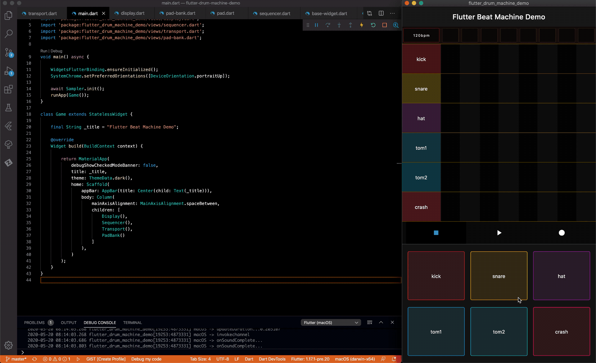

# flutter_drum_machine_demo
An example project demonstrating how to build a beat machine in Flutter

## Getting Started
To run this project:
* clone this repo
* `cd` into project directory and run `flutter pub get`
* ensure you have a connected device or running emulator start with `flutter run`

Thanks for checking it out!
___
